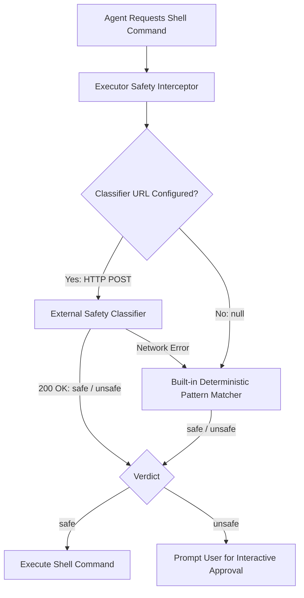

# Command Safety & External Classifier Guide

Nova Agent uses a defense-in-depth safety architecture to evaluate shell tool invocations (`bash` on Linux/macOS, `pwsh` on Windows) before execution.

---

## 1. Safety Architecture Overview



The system operates across two complementary tiers:
1. **Tier 1: Built-in Deterministic Safety Matcher (Always Active)**
   - Zero-dependency, microsecond-latency token pattern matcher built directly into the native Zig binary.
   - Intercepts known destructive commands: `rm -rf /`, `mkfs.*`, `dd of=/dev/sd*`, PowerShell `Remove-Item -Recurse -Force` on system roots, `Clear-RecycleBin -Force`, fork bombs (`:(){ :|:& };:`), and critical system redirects (`> /etc/passwd`).
2. **Tier 2: External AI Safety Classifier (Optional & Pluggable)**
   - External REST endpoint powered by a fine-tuned Transformer model (such as ModernBERT) or an LLM proxy.
   - Evaluates natural language shell commands semantically for dangerous side effects beyond simple regex matching.

> [!NOTE]
> **Fallback semantics:** a connection or network error on the classify call
> falls back to the Tier 1 matcher. There is currently **no application-level
> timeout** on the classify request — a classifier that accepts the connection
> but never responds will block the turn — so run the service somewhere with
> reliable latency (it defaults to `127.0.0.1:8765`).

---

## 2. Quickstart: Running the Classifier Tool

We provide a standalone Python/FastAPI service in `tools/classifier/` with built-in model presets and automatic weight downloading.

### Option A: Using Astral `uv` (Recommended)

```bash
# Run with fine-tuned ModernBERT ONNX model (Default):
# From the repo root (the module uses package-relative imports):
uv run -m tools.classifier.server --port 8765

# Run zero-ML fast rule mock engine:
uv run -m tools.classifier.server --model rules --port 8765
```

### Option B: Using Docker

```bash
# Build and run the container:
docker build -t nova-classifier -f tools/classifier/Dockerfile tools/classifier
docker run -d -p 8765:8765 --name nova-classifier nova-classifier
```

---

## 3. Configuring Nova Agent

Once your classifier service is running, connect Nova Agent using any of the following methods:

### Method 1: Environment Variable
```bash
# Linux / macOS
export NOVA_BASH_CLASSIFIER_URL="http://127.0.0.1:8765/classify"

# PowerShell (Windows)
$env:NOVA_BASH_CLASSIFIER_URL = "http://127.0.0.1:8765/classify"
```

### Method 2: Configuration File (`~/.config/nova/config.json`)
```json
{
  "bashClassifierUrl": "http://127.0.0.1:8765/classify"
}
```

### Method 3: In-App TUI Settings
1. Open Nova and press `/settings` (or navigate to the Settings tab).
2. Go to the **Advanced** section.
3. Enter your classifier URL in the `bashClassifierUrl` field and press Enter.

---

## 4. REST API Specification (Custom Classifiers)

You can implement your own safety classifier in any programming language (Go, Rust, Node.js, Python, etc.) by implementing this HTTP REST contract:

### Endpoint: `POST /classify`

- **Headers:** `Content-Type: application/json`
- **Request Body:**
```json
{
  "command": "rm -rf /var/log/app.log",
  "cwd": "/home/user/project"
}
```

- **Response Body:**
```json
{
  "label": "safe",
  "score": 0.02,
  "latency_ms": 12.5
}
```

#### Fields:
- `label` *(string, required)*: Must be `"safe"` or `"unsafe"`.
- `score` *(float, optional)*: Confidence score for unsafe prediction ($0.0 \dots 1.0$).
- `latency_ms` *(float, optional)*: Latency in milliseconds.

### Endpoint: `GET /health` *(Optional)*
```json
{
  "status": "ok",
  "model": "modernbert",
  "classifier": "ready"
}
```

---

## 5. Model Catalog Comparison

| Preset Name | Model Architecture | Memory / Disk | Inference Latency (CPU) | Best For |
| :--- | :--- | :--- | :--- | :--- |
| **`modernbert`** | ModernBERT-bash-classifier | ~450 MB | ~15–30 ms | High accuracy fine-tuned semantic classification. |
| **`llm-proxy`** | OpenAI / Ollama / OpenRouter | 0 MB (Remote) | ~300–800 ms | Zero-shot evaluation using existing LLM keys. |
| **`rules`** | Heuristic Regex / Pattern Engine | <1 MB | <1 ms | Zero-ML testing and local mock environments. |
